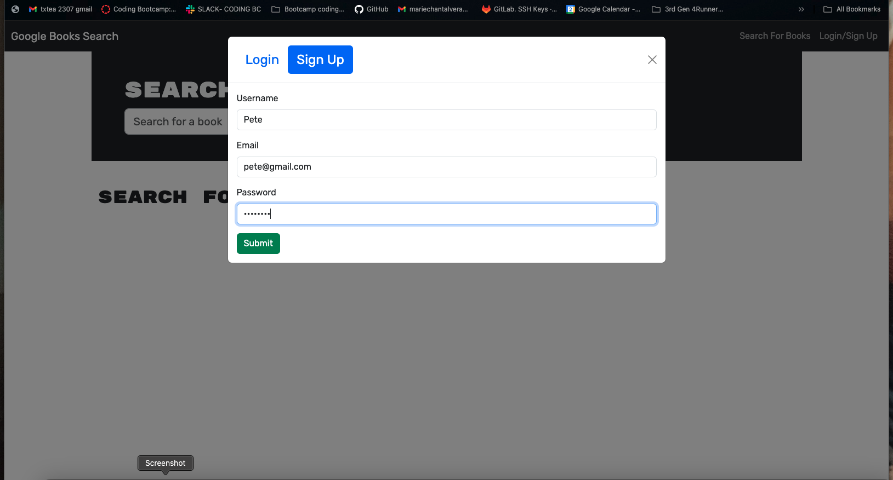
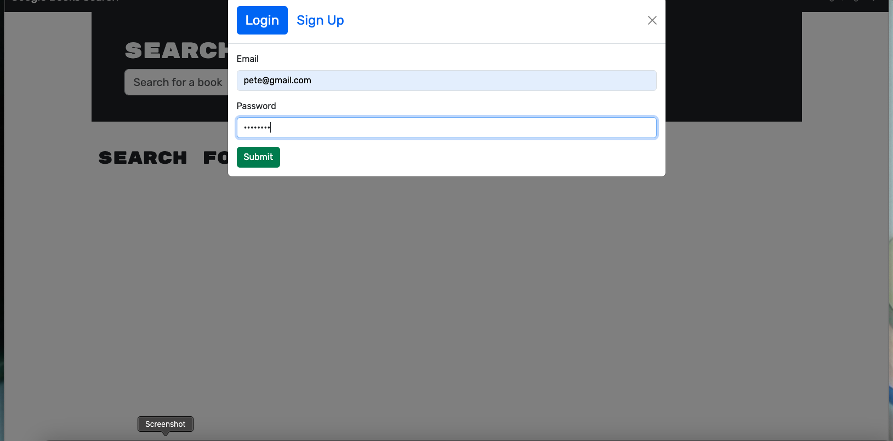
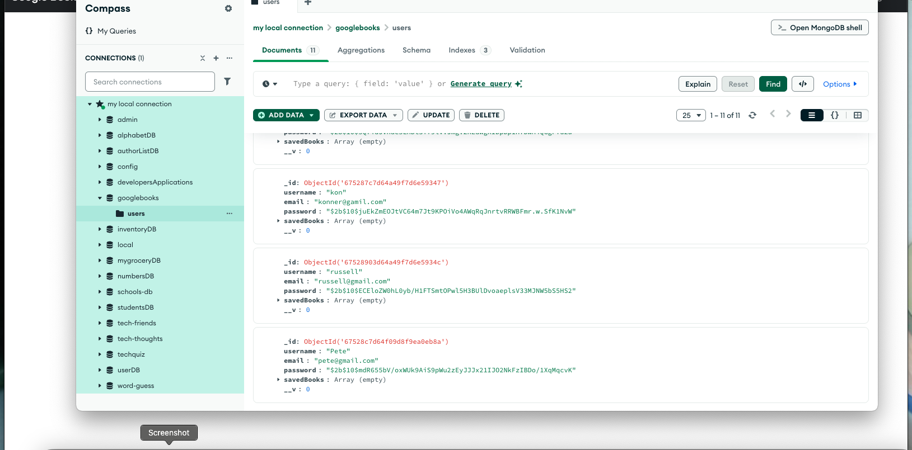
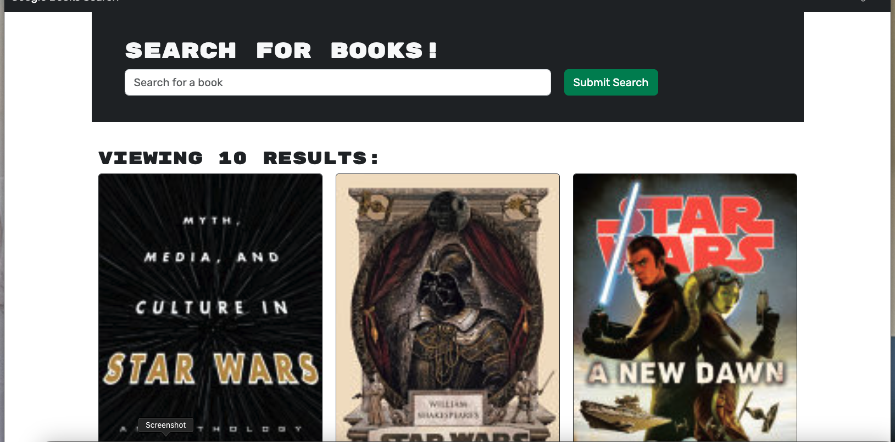

# Book Search Engine

<div align="center">


</div>

<div align="center">
 
  <h3 align="center">MC Foster Portfolio</h3>

  <p align="center">
About App

  <br />
    <a href=""><strong>Explore the docs »</strong></a>
  </p>
</div>

  [Render Deployment](had difficulty)

      

<details>
  <summary>Table of Contents</summary>
  <ol>
    <li>
      <a href="#about-the-project">About The Project</a>
      <ul>
        <li><a href="#built-with">Built With</a></li>
      </ul>
    </li>
    <li>
      <a href="#getting-started">Getting Started</a>
      <ul>
        <li><a href="#installation">Installation</a></li>
      </ul>
    </li>
    <li><a href="#usage">Usage</a></li>
    <li><a href="#roadmap">Roadmap</a></li>
    <li><a href="#contributing">Contributing</a></li>
    <li><a href="#license">License</a></li>
    <li><a href="#contact">Contact</a></li>
    <li><a href="#acknowledgments">Acknowledgments</a></li>
  </ol>
</details>


## About The Project

This project is a refactored Google Books search engine that transitions from a RESTful API to a GraphQL API using Apollo Server. Built on the MERN stack (MongoDB, Express.js, React, Node.js), it allows users to search for books via the Google Books API and save their favorite searches to a personalized list. Designed for avid readers, this app provides a seamless way to discover new books and keep track of titles to purchase for your reading journey.

[Walk-Thru](https://youtu.be/hRxMg29lfLE)










This project was built using React, JS

### Built With

<div align="center">


[](https://javascript.info/)
[](https://developer.mozilla.org/en-US/docs/Web/CSS)
[](https://react.org/en/)
[](https://expressjs.com/)
[](https://www.mongodb.com/)
[](https://code.visualstudio.com/docs)
[](https://www.postgresql.org/docs/)
[](https://www.typescriptlang.org/)
[](https://www.npmjs.com/package/vite)
[](https://www.npmjs.com/package/nodemon)
[](https://jwt.io/)


</div>


## Getting Started

Once completely built, this application will function as a deployed app on Render.

### Local Installation / Testing

1. Clone the rep

```
git clone 
```

2. Install dependencies

```
npm i
```

3. Launch the app in development environment

```
npm run build && npm run develop
```

4. It will show running on 
```
localhost:3000 in your browser
```
5. GraphQL will brunning on  
```
http://localhost:3001/graphql
```
#### MVP


- [ ] Front End

  - [ ] Landing Page
    - [ ] Routing
    - [ ] Styling

- [ ] Back End
  - [ ] Models
  - [ ] Seeds
  - [ ] Routing


## Contributing

Contributions are what make the open source community such an amazing place to learn, inspire, and create. Any contributions you make are **greatly appreciated**.

If you have a suggestion that would make this better, please fork the repo and create a pull request. You can also simply open an issue with the tag "enhancement".
Don't forget to give the project a star! Thanks again!

1. Fork the Project
2. Create your Feature Branch (git checkout -b feature/AmazingFeature)
3. Commit your Changes (git commit -m 'Add some AmazingFeature')
4. Push to the Branch (git push origin feature/AmazingFeature)
5. Open a Pull Request


## License

[](https://opensource.org/licenses/MIT)

This project is licensed under the MIT license.


## Contact


[Marie-Chantal Foster](mariechantalfoster@gmail.com) 

Project Links:

[Github Repository](https://github.com/MCFoster007/Book-Search-Engine)

[Github Pages Deployment](https://mcfoster007.github.io/Book-Search-Engine/)


[Render Deployment](https://book-search-engine-62or.onrender.com)  Difficulty to launch


## Acknowledgments
Thank my tutors, Mary, Cody, Katie and Dan the instructor who helped me and guided me on the project.


